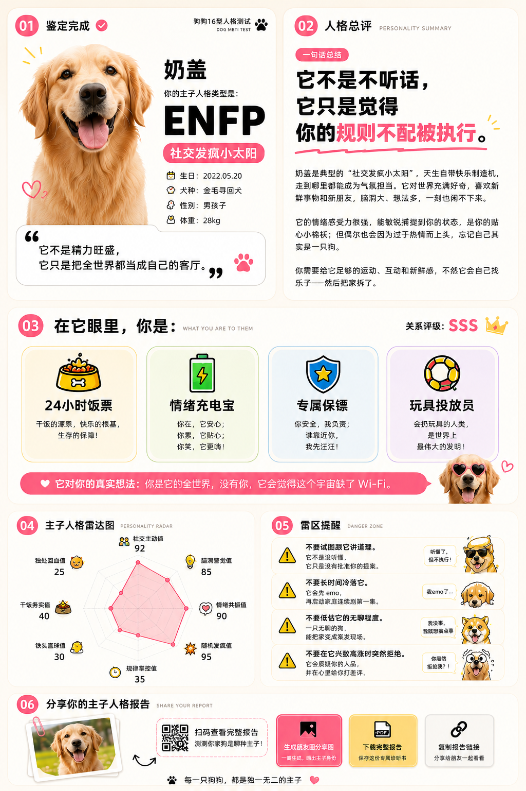

# 狗狗 16 型主子人格测试 🐶

一个 MBTI 风格的趣味测评网站：上传狗狗照片、回答 24+1 道问题，由 AI 生成一份"奶油毒舌"风格的主子人格报告，并可一键导出**方形朋友圈分享海报**与**完整 PDF 报告**。

🔗 **在线体验**：https://dog16.vercel.app



> 全栈 Next.js（App Router）应用，AI 报告生成支持 Anthropic Claude 或 DeepSeek（二选一）。本地开发用文件系统存储，无需数据库；部署到 Vercel 时自动切换为 Vercel Blob 存储（见下方「部署到 Vercel」）。

## ✨ 功能

- **资料 + 问卷**：填写狗狗资料、上传照片，完成 25 题测评
- **AI 人格报告**：根据计分结果调用大模型生成结构化报告（人格类型、总评、主人定位、维度雷达、危险区等）
- **方形分享海报**：1080×1080 两栏式"人格卡"，含宠物照片、人格代号、称号、一句话吐槽、四维度、二维码，配豆沙粉高级感配色
- **PDF 导出**：导出完整报告页（`html2canvas` + `jsPDF`）
- **二维码**：服务端生成，扫码可访问报告页

## 🧱 技术栈

- [Next.js 15](https://nextjs.org/)（App Router）+ React 19 + TypeScript
- [Tailwind CSS 3](https://tailwindcss.com/)
- AI：[`@anthropic-ai/sdk`](https://www.npmjs.com/package/@anthropic-ai/sdk) 或 [`openai`](https://www.npmjs.com/package/openai)（DeepSeek 兼容）
- 图像/文档：`html2canvas`、`jspdf`、`qrcode`
- 存储：本地文件（`reports/*.json`、`public/uploads/`）/ 生产环境 [Vercel Blob](https://vercel.com/docs/storage/vercel-blob)，按环境变量自动切换

## 🚀 本地开发

### 1. 安装依赖

```bash
npm install
```

### 2. 配置环境变量

复制示例文件并填入你自己的密钥：

```bash
cp .env.example .env.local
```

`.env.local` 字段说明：

| 变量 | 说明 |
| --- | --- |
| `AI_PROVIDER` | `anthropic` 或 `deepseek`，决定调用哪个模型 |
| `ANTHROPIC_API_KEY` / `ANTHROPIC_MODEL` | 使用 Claude 时填写 |
| `DEEPSEEK_API_KEY` / `DEEPSEEK_MODEL` | 使用 DeepSeek 时填写 |
| `NEXT_PUBLIC_BASE_URL` | 报告链接 / 二维码用的站点地址，本地为 `http://localhost:3000` |

> ⚠️ `.env.local` 已被 `.gitignore` 忽略，**切勿提交真实密钥**。

### 3. 启动

```bash
npm run dev
```

打开 http://localhost:3000 即可。

> 💡 构建生产版本前请先停掉 `npm run dev`，避免两个进程同时写 `.next` 导致构建产物损坏。

```bash
npm run build
npm run start
```

## 📁 目录结构

```
app/                  页面与 API 路由
  page.tsx            首页
  test/               资料 + 问卷
  generating/         AI 生成中的加载页
  report/[id]/        报告页
  api/upload/         照片上传
  api/generate/       调用 AI 生成报告
components/
  report/             报告各卡片 + 分享海报（SharePoster）
  visual/             图标与涂鸦组件
lib/                  问卷、计分、AI 调用、存储、类型定义
public/uploads/       用户上传的照片（运行时生成，git 忽略）
reports/              生成的报告 JSON（运行时生成，git 忽略）
```

## ☁️ 部署到 Vercel（免费，无需自己的服务器）

本项目可一键部署到 [Vercel](https://vercel.com/)。因为 Vercel 是无服务器环境、本地文件不会持久化，所以报告与上传照片改用 **Vercel Blob** 存储——代码已做好自动切换，只要配置好下面的环境变量即可。

1. **导入仓库**：登录 Vercel → New Project → 选择本 GitHub 仓库 → Import。
2. **创建 Blob 存储**：项目页 → Storage → Create → **Blob**，创建后点 Connect 关联到本项目。
   连接后 Vercel 会自动注入 `BLOB_READ_WRITE_TOKEN`，代码检测到它就会启用 Blob 存储。
3. **配置环境变量**（Project → Settings → Environment Variables）：

   | 变量 | 值 |
   | --- | --- |
   | `AI_PROVIDER` | `anthropic` 或 `deepseek` |
   | `ANTHROPIC_API_KEY` / `ANTHROPIC_MODEL` | 用 Claude 时填 |
   | `DEEPSEEK_API_KEY` / `DEEPSEEK_MODEL` | 用 DeepSeek 时填 |
   | `NEXT_PUBLIC_BASE_URL` | 部署后的正式地址，如 `https://你的项目.vercel.app` |

4. **Deploy**，等待构建完成即可得到一个公开访问的在线地址。

> ⚠️ `NEXT_PUBLIC_BASE_URL` 必须设为正式域名，否则报告分享链接与二维码会指向 `localhost`。
> 改完此变量后需 **Redeploy** 才会生效。
>
> 💡 想自建国内服务器（阿里云 / 腾讯云 + Nginx）部署，参见 [`DEPLOY.md`](DEPLOY.md)。

## 📝 说明

- `public/uploads/` 与 `reports/` 中的运行时数据不纳入版本管理（仅保留 `.gitkeep`）。
- 本项目仅供学习与娱乐，AI 生成内容请勿当真。

## 📄 License

[MIT](LICENSE) © Marco
